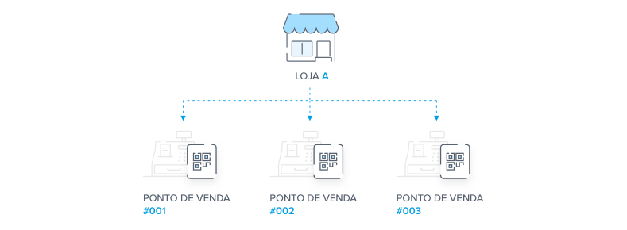
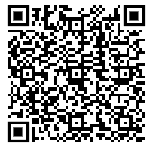
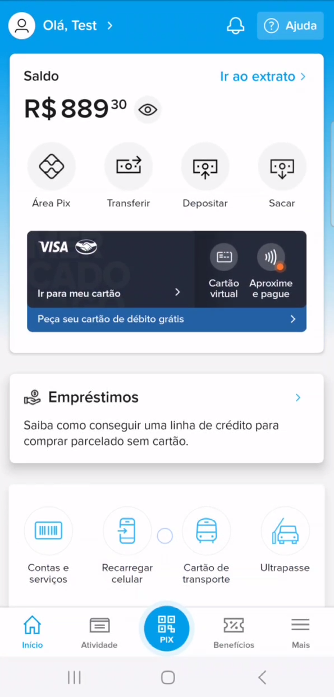

Guia com ordem de execução das APIs.

# Configuração - Acesso à API Mercado Pago

Acesse a [Documentação do Mercado Pago](https://www.mercadopago.com.br/developers/pt/docs/qr-code/integration-configuration/qr-dynamic/integration). Você precisará:
* Criar uma conta de usuário,
* criar um usuário de teste vendedor,
* criar um usuáro de teste cliente.

As instruções de como realizar a criação de contas encontra-se em [Mercado Pago Developers - Pré-requisitos](https://www.mercadopago.com.br/developers/pt/docs/qr-code/pre-requisites).

Com o cadastro realizado, agora você pode obter suas credenciais de acesso à API do Mercado Pago. Para isso, primeiro crie uma integração. Veja o guia em [Mercado Pago > Integrações > Credenciais](https://www.mercadopago.com.br/developers/pt/docs/qr-code/additional-content/your-integrations/credentials).

Com suas credenciais em mãos, agora poderá criar uma loja, associar um ponto de venda (também conhecido como pos, ou caixa) e permitir que a aplicação envie e receba os pedidos de pagamento à API do Mercado Pago via integração.

Links úteis:
* [Glossário - Mercado Pago](https://www.mercadopago.com.br/developers/pt/docs/qr-code/integration-configuration/qr-dynamic/introduction)
* [Lojas e Caixas - Mercado Pago](https://www.mercadopago.com.br/developers/pt/docs/qr-code/stores-pos/stores-and-pos)
* [Vídeo tutoriais - Mercado Pago](https://www.mercadopago.com.br/developers/pt/docs/qr-code/resources/tutorial-videos/qr-videos-dynamic)

Segue abaixo uma ilustração de Loja x Ponto de Venda.
<p align="center">
    </img>
</p>

## Cadastro de Credenciais
Em nossa API acesse `/integracoes/mercadoPago/cadastroCredenciais`. Segue um payload de exemplo:
```json
{
  "nome": "MERCADO_PAGO",
  "token": "APP_USR-3799555180154211-072019-f93535197182208bb828baac793e87eb-1900940291",
  "usuario": "1900940291",
  "webHook": "https://aws-food-app-exemplo.com"
}
```

## Cadastro de Loja
Em nossa API acesse `/integracoes/mercadoPago/cadastroLojaMercadoPago`. Segue um payload de exemplo:
```json
{
  "name": "Tech Challenge Filial - SP",
  "businessHours": [
    {
      "dia": "monday",
      "intervalos": [
        {
          "open": "08:00",
          "close": "11:00"
        }
      ]
    }
  ],
  "location": {
    "streetNumber": "3039",
    "streetName": "Av. Paulista",
    "cityName": "São Paulo",
    "stateName": "São Paulo",
    "latitude": -21.7108032,
    "longitude": -46.6004147,
    "reference": "Near to Mercado Pago"
  },
  "externalId": "TECHLOJA001",
  "credenciaisId": 1
}
```

O atributo `"credenciaisId"` recebe o código da credencial cadastrada em nossa base.

O atributo `"TECHLOJA001"` representa o código de identificação da loja para a integração.

## Cadastro do Caixa
Em nossa API acesse `/integracoes/mercadoPago/cadastrarCaixaLojaMercadoLivre`. Segue um payload de exemplo:
```json
{
  "category": null,
  "external_id": "TECHCAIXA001",
  "external_store_id": "TECHLOJA001",
  "fixed_amount": true,
  "name": "Caixa filial SP",
  "store_id": 62304251
}
```
O atributo `"TECHCAIXA001"` representa o código de identificação do caixa para o pagamento via QR Code gerado.

O atributo `"TECHLOJA001"` representa o código de identificação da loja para a integração.

O atributo `"store_id"` representa o ID de identificação da loja.

# Clientes
Não é um pré-requisito que clientes sejam identificados para realização de pedidos. Mas clientes identificados podem receber desconto.


## Realização de Pedidos

Em nossa API acesse `/pedido/cadastroPedido`. Segue um payload de exemplo:
```json
{
  "cliente": 1,
  "pedidoProdutos": [
    {
      "produto": 1,
      "quantidade": 2
    }
  ],
  "statusPedido": "RECEBIDO",
  "credencialId": 1,
  "caixaId": 1
}
```
O atributo `"cliente"` não é obrigatório. Representa o ID do cliente cadastrado em nossa base.

O atributo `"credencialId"` representa o ID da credencial cadastrada em nossa base, conforme explicado na seção acima "Cadastro de Credenciais".

O atributo `"caixaId"` representa o ID do ponto de venda (caixa) cadastrado em nossa base.

### Pagamento

Primeiro pegue o retorno da chamada em texto no padrão EMVCo. Segue um exemplo:
```
00020101021243650016COM.MERCADOLIBRE020130636e425f93b-fd59-4e37-9d54-447b71a654aa5204000053039865802BR5909Test Test6009SAO PAULO62070503***6304FA29
```

Gere o QR Code através de algum front-end:
<p align="center">
    </img>
</p>

Para realizar o pagamento é necessário baixar o aplicativo do Mercado Pago na [Play Store](https://play.google.com/store/apps/details?id=com.mercadopago.wallet&hl=pt_BR) ou [Apple Store](https://apps.apple.com/br/app/mercado-pago-banco-digital/id925436649). Após baixá-lo, acesse o aplicativo com seu "usuário cliente" criado no início deste guia.

Faça a leitura do QR Code através do aplicativo, realize o pagamento (verificar saldo em conta) e aguarde a API do Mercado Pago retornar a aprovação do pagamento.

<p align="center">
    </img>
</p>


## Consultar Pedidos
Em nossa API acesse `/pedido/pesquisarPedidosEmAberto`. Este endpoint retorna todos pedidos que estão com o status de "Recebido", "Em Preparação" e "Pronto" dos pedidos mais antigos aos mais recentes, ordenados primeiro pelos que estão como "Pronto", seguidos de "Em Preparação" e "Recebido".

## Atualizar Pedido
Em nossa API acesse `/pedido/atualizarStatusPedido`. Este endpoint identifica o status atual do pedido e o avança para o próximo status.

# Outros - API
Para gerenciar o catálogo de produtos, cadastrar clientes, receber desconto ou outros, consulte a doc da API via swagger:
* local: http://localhost:8091/api/swagger-ui/index.html
* nuvem: https://endereco-na-nuvem-exemplo:8091/api/swagger-ui/index.html